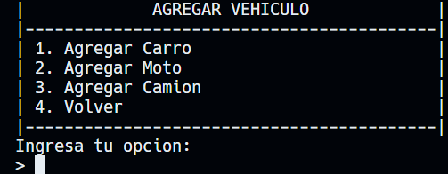
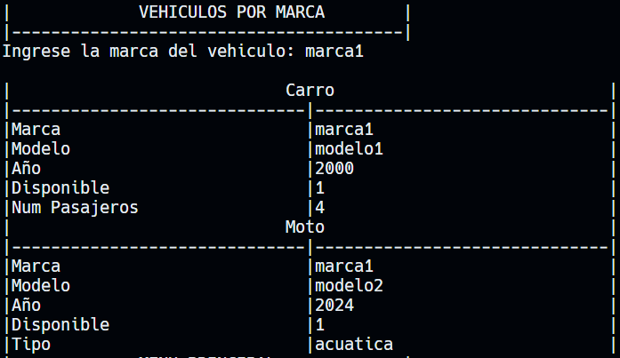
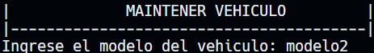

# Tarea 1

| Nombre | Carnet |
| ------ | ------ |
| Su nombre | Su carnet |

## Uso de POO

### Clase Principal:

```python
from clases.Vehiculo import Vehiculo


class Concesionario:
    def __init__(self):
        self.vehiculos = []
    
    def agregarVehiculo(self, vehiculo: Vehiculo):
        self.vehiculos.append(vehiculo)
    
    def mostrarVehiculos(self):
        for vehiculo in self.vehiculos:
            vehiculo.informacionDetallada()
    
    def buscarPorMarca(self, marca):
        for vehiculo in self.vehiculos:
            if vehiculo.marca == marca:
                vehiculo.informacionDetallada()
    
    def eliminarVehiculo(self, modelo):
        for vehiculo in self.vehiculos:
            if vehiculo.modelo == modelo:
                self.vehiculos.remove(vehiculo)
    
    def mantenerVehiculo(self, modelo):
        for vehiculo in self.vehiculos:
            if vehiculo.modelo == modelo:
                vehiculo.mantenimiento()
    
    def disponibilizarVehiculo(self, modelo):
        for vehiculo in self.vehiculos:
            if vehiculo.modelo == modelo:
                vehiculo.disponibilizar()
```

### Clase Padre:

```python
class Vehiculo:
    def __init__(self, marca, modelo, anio):
        self.marca = marca
        self.modelo = modelo
        self.anio = anio
        self.disponible = True
    
    def mantenimiento(self):
        self.disponible = False
    
    def disponibilizar(self):
        self.disponible = True
    
    def informacionDetallada(self):
        print(f"|{"Vehiculo":^61}|")
        print("|"+"-" * 30 + "|" + "-" * 30+"|")
        print(f"|{"Marca":<30}|{self.marca:<30}|" )
        print(f"|{"Modelo":<30}|{self.modelo:<30}|")
        print(f"|{"Año":<30}|{self.anio:<30}|")
        print(f"|{"Disponible":<30}|{self.disponible:<30}|")
    
    #Encapsulamiento
    def getMarca(self):
        return self.marca
    
    def getModelo(self):
        return self.modelo
    
    def getAnio(self):
        return self.anio
    
    def getDisponible(self):
        return self.disponible
    
    def setMarca(self, marca):
        self.marca = marca

    def setModelo(self, modelo):
        self.modelo = modelo

    def setAnio(self, anio):
        self.anio = anio

    def setDisponible(self, disponible):
        self.disponible = disponible
```

### Clase Hijo 1: Carro

```python
from clases.Vehiculo import Vehiculo


class Carro(Vehiculo):
    def __init__(self, marca, modelo, anio, numPasajeros):
        super().__init__(marca, modelo, anio)
        self.numPasajeros = numPasajeros
    
    def informacionDetallada(self):
        print(f"|{"Carro":^61}|")
        print("|"+"-" * 30 + "|" + "-" * 30+"|")
        print(f"|{"Marca":<30}|{self.marca:<30}|" )
        print(f"|{"Modelo":<30}|{self.modelo:<30}|")
        print(f"|{"Año":<30}|{self.anio:<30}|")
        print(f"|{"Disponible":<30}|{self.disponible:<30}|")
        print(f"|{"Num Pasajeros":<30}|{self.numPasajeros:<30}|")
    
    def getNumPasajeros(self):
        return self.numPasajeros

    def setNumPasajeros(self, numPasajeros):
        self.numPasajeros = numPasajeros
```

### Clase Hijo 2: Moto

```python
from clases.Vehiculo import Vehiculo


class Moto(Vehiculo):
    def __init__(self, marca, modelo, anio, tipo):
        super().__init__(marca, modelo, anio)
        self.tipo = tipo
    
    def informacionDetallada(self):
        print(f"|{"Moto":^61}|")
        print("|"+"-" * 30 + "|" + "-" * 30+"|")
        print(f"|{"Marca":<30}|{self.marca:<30}|" )
        print(f"|{"Modelo":<30}|{self.modelo:<30}|")
        print(f"|{"Año":<30}|{self.anio:<30}|")
        print(f"|{"Disponible":<30}|{self.disponible:<30}|")
        print(f"|{"Tipo":<30}|{self.tipo:<30}|")
    
    def getTipo(self):
        return self.tipo

    def setTipo(self, tipo):
        self.tipo = tipo
```

### Clase Hijo 3: Camion

```python
from clases.Vehiculo import Vehiculo


class Camion(Vehiculo):
    def __init__(self, marca, modelo, anio, capacidadCarga):
        super().__init__(marca, modelo, anio)
        self.capacidadCarga = capacidadCarga
    
    def informacionDetallada(self):
        print(f"|{"Camion":^61}|")
        print("|"+"-" * 30 + "|" + "-" * 30+"|")
        print(f"|{"Marca":<30}|{self.marca:<30}|" )
        print(f"|{"Modelo":<30}|{self.modelo:<30}|")
        print(f"|{"Año":<30}|{self.anio:<30}|")
        print(f"|{"Disponible":<30}|{self.disponible:<30}|")
        print(f"|{"Capacidad Carga":<30}|{self.capacidadCarga:<30}|")
    
    def getCapacidadCarga(self):
        return self.capacidadCarga

    def setCapacidadCarga(self, capacidadCarga):
        self.capacidadCarga = capacidadCarga
```

## Programa

Para usar este programa usa el siguiente comando en la terminal:

```bash
py main.py
```

### Menú Principal

Al momento de iniciar el programa se debe desplegar en consola un menú con las siguientes
opciones:
1. Agregar Vehículo
2. Mostrar Vehículos
3. Mostrar Vehículos por Marca
4. Eliminar Vehículo
5. Mantener Vehículo
6. Disponibilizar Vehículo
7. Salir

El usuario deberá ingresar un número para escoger una opción.


### Ingresar Vehículo

Al momento de que el usuario quiera ingresar un recurso, le aparecerán las siguientes opciones:
1. Agregar Carro
2. Agregar Moto
3. Agregar Camión
4. Volver (Esta opción regresa al menú principal)

Conforme a la opción que escoja, el usuario ingresara los atributos de cada recurso.



#### Agregar Carro

Se solicitan y se ingresan los atributos del Carro


#### Agregar Moto

Se solicitan y se ingresan los atributos de la Moto


#### Agregar Camión

Se solicitan y se ingresan los atributos del Camión


### Mostrar Vehículos

Al entrar a esta opcion mostrará lo siguiente:


### Mostrar vehículos por Marca

Al entrar a esta opción el usuario deberá ingresar la marca del carro y enlistará todos los vehículos de esa marca.



### Eliminar Vehículo
Al entrar a esta opción el usuario deberá ingresar el modelo del vehículo que quiere eliminar.


Prueba de que el vehículo se eliminó:


### Mantener Vehículo

Al entrar a esta opción el usuario deberá ingresar el modelo del vehículo que quiere poner en mantenimiento.



El estado de disponibilidad cambio a 0:


### Disponibilizar Vehículo

Al entrar a esta opción el usuario deberá ingresar el modelo del vehículo que quiere poner en disponibilidad.


El estado de disponibilidad cambio a 1:


### Salir

Al seleccionar `Salir` el sistema se cierra.

