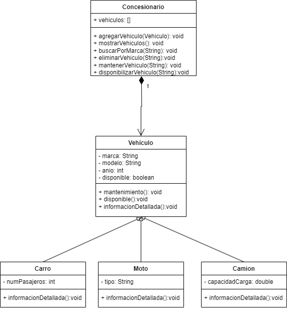

# Ejemplo Clase 2

El ejemplo desarrollado en clase se tomará de base el siguiente diagrama de clases:

Considerando lo siguiente para crear la aplicación:

1. **Clase Vehículo**: Es la clase padre y tiene los siguientes atributos y métodos:
    - Atributos: 
        - `marca` (String): Marca del vahículo
        - `modelo` (String): Modelo del vehículo
        - `anio` (int): Año de fabricación del vehículo.
        - `disponible`(boolean): Indica si el vehículo está disponible o se encuentra en mantenimiento.
    - Métodos:
        - `mantenimiento()`(void): Cambia el estado del vehículo a mantenimiento.
        - `disponible()`(void): Cambia el estado del vehículo a disponible.
        - `informacionDetallada()`(void): Muestra la información detallada del vehículo en formato de tabla.
2. **Clase Carro**: Es la clase hijo y tiene los siguientes atributos y métodos:
    - Atributos: 
        - `numPasajeros` (int): Número máximo de pasajeros.
    - Métodos:
        - `informacionDetallada()`(void): Muestra la información detallada del vehículo en formato tabla.
3. **Clase Moto**: Es la clase hijo y tiene los siguientes atributos y métodos:
    - Atributos: 
        - `tipo` (String): Tipo de motocicleta como `"Deportiva"`, `"Turismo"` o `"Scooter"`.
    - Métodos:
        - `informacionDetallada()`(void): Muestra la información detallada del vehículo en formato tabla.
4. **Clase Camion**: Es la clase hijo y tiene los siguientes atributos y métodos:
    - Atributos: 
        - `capacidadCarga` (String): Capacidad máxima de carga (en toneladas).
    - Métodos:
        - `informacionDetallada()`(void): Muestra la información detallada del vehículo en formato tabla.
5. **Clase Concesionario**: Es la clase principal del sistema y cuenta con los siguientes atributos y métodos:
    - Atributos:
        - `vehiculos` (list): Lista de los vehículos que cuenta el concesionario.
    - Métodos:
        - `agregarVehículo(Vehículo)`(void): Añade un nuevo vehículo a la lista.
        - `mostrarVehiculos()`(void): Muestra la información de todos los vehículos en la lista.
        - `buscarPorMarca(String)`(void): Muestra la lista de vehículos de una marca específica.
        - `eliminarVehículo(Vehículo)`(void): Elimina un vehículo de la lista por medio de su modelo.
        - `mantenerVehículo(String)`(void): Cambia el estado de disponible a mantenimiento de un vehículo específico encontrado por medio de su modelo. Quiere decir que el atributo de disponible esta en `False`.
        - `disponibilizarVehículo(String)`(void): Cambia el estado de mantenimiento a disponible de un vehículo específico encontrado por medio de su modelo. Quiere decir que el atributo de disponible esta en `True`.
